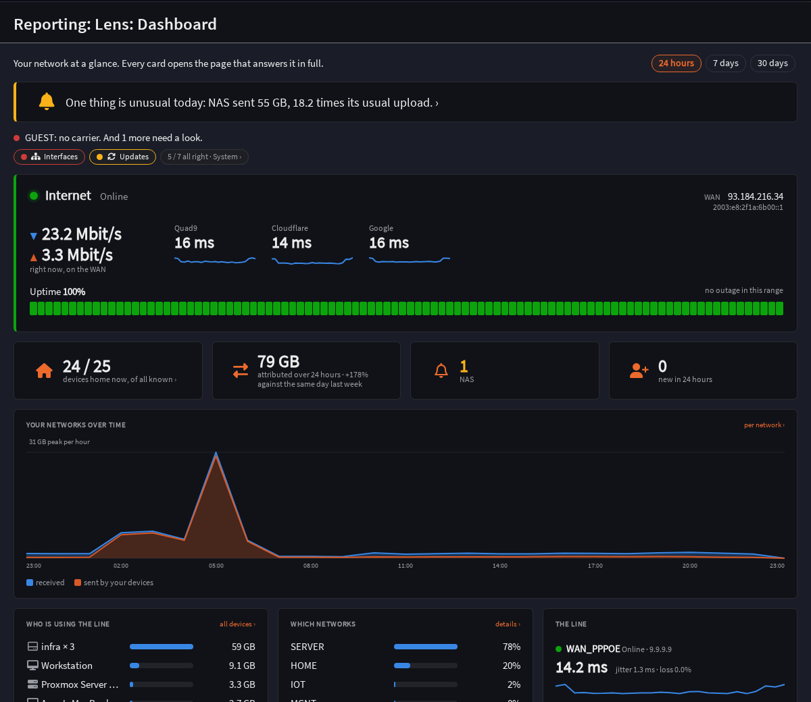
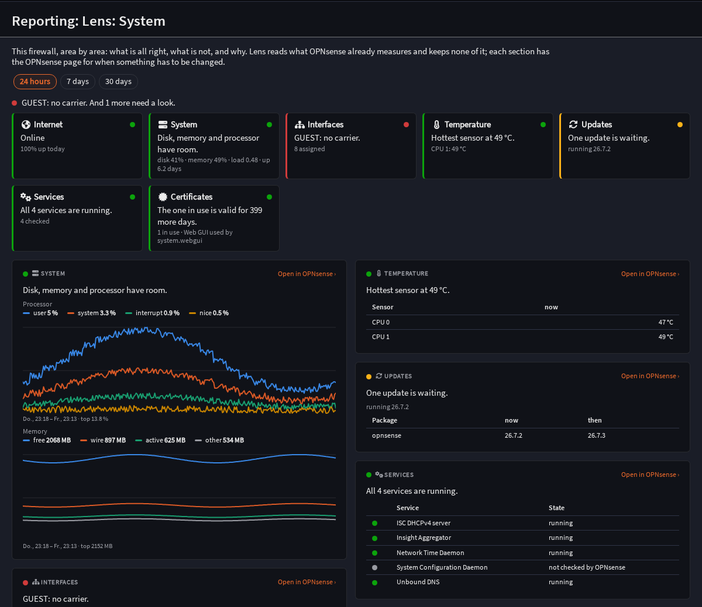
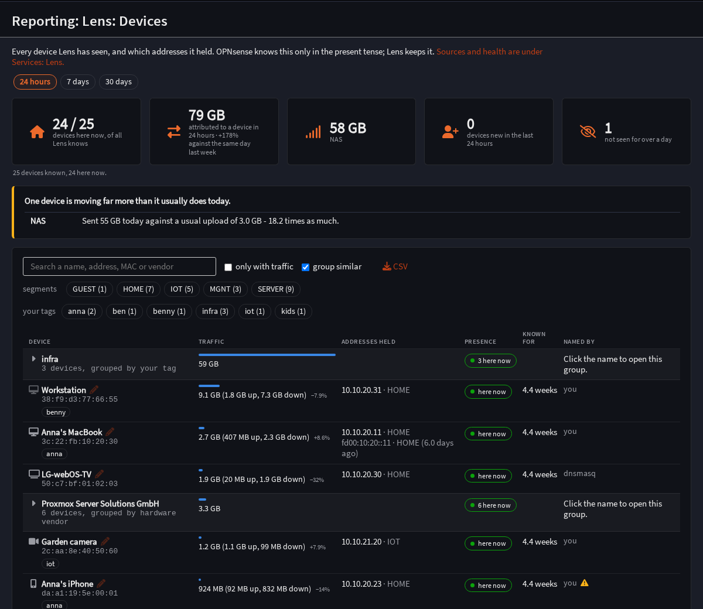
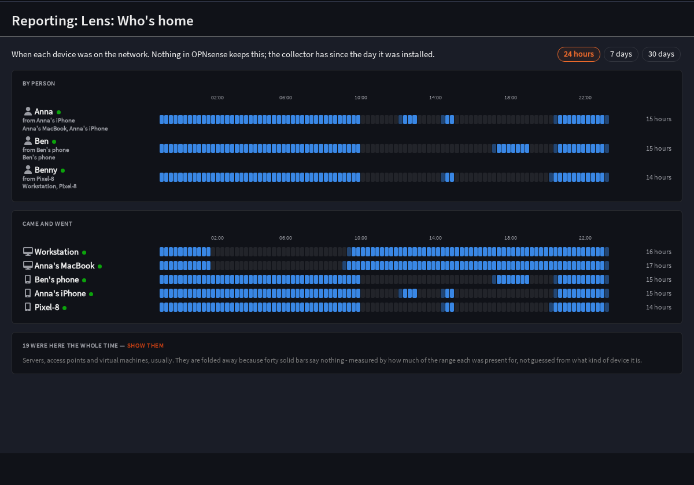
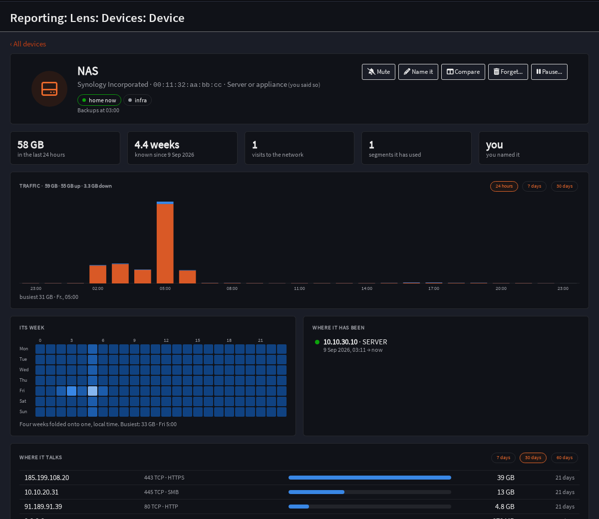
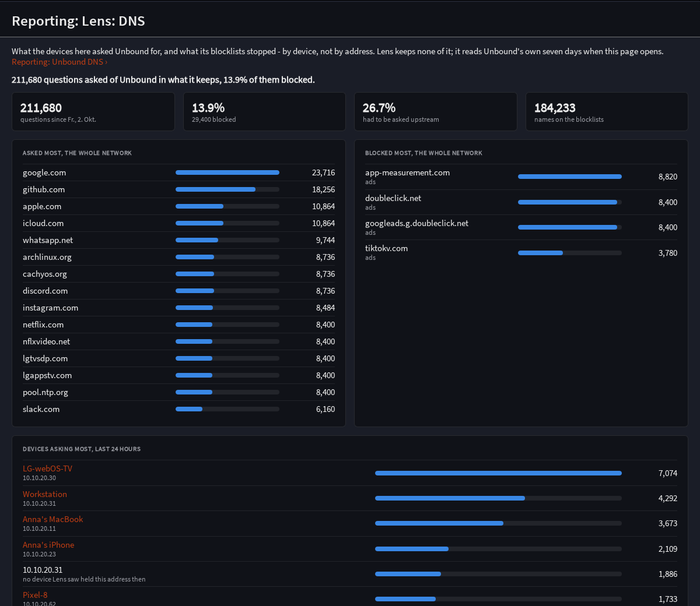

# Lens — an OPNsense plugin

**The calm front page for your OPNsense firewall: who is on the network, what
they did, and whether everything is all right.**

Lens gives every device an identity that survives an address change and hangs
everything the firewall knows off it — traffic history, DNS, presence, the
internet line. On top of that it answers *is everything all right* in one
sentence, area by area, from what OPNsense already measures.

**Status:** version 0.x. Every release is installed and checked on two real
firewalls — OPNsense 26.1 and 26.7 — by a scripted round before it ships
([docs/ROUTER-ROUND.md](docs/ROUTER-ROUND.md)); what is proven on a box and what
only in tests is in [docs/ROADMAP.md](docs/ROADMAP.md).



## What it shows

| Page | What it answers |
|---|---|
| **Dashboard** | One sentence first; the areas that need a look; the internet line with public address, round trips and an uptime strip you can hover; who is home, what moved, what was unusual |
| **System** | Every area of the firewall — internet, system, interfaces, temperature, updates, services, certificates, and DynDNS, SMART, WireGuard, NetBird, Tailscale where installed — with its reason, its history from OPNsense's own records, and the OPNsense page that fixes it |
| **Devices** | Every device, by the name it is known by, with its traffic, its addresses over time, presence and how sure Lens is of each |
| **A device** | Its traffic hour by hour, its week, where it talks, what it looked up, which services it asked for; name it, tag it, pause it |
| **Who's home** | When each device — and each person, by the phones they carry — was on the network |
| **Networks** | Each network with its port (link, speed, errors) and the devices on it |
| **DNS** | What was asked and blocked, by device, and which services (Netflix, Steam, WhatsApp …) the names belong to |
| **Events, weekly report, wallboard** | What happened while you were not looking; a week on one page; a screen for the wall |

Plus widgets for OPNsense's own dashboard, a Prometheus endpoint, and a search
on every Lens page (`Ctrl K`) that finds devices, networks and OPNsense's own
menu.

| | | |
|---|---|---|
|  |  |  |
|  |  | |

*Screenshots from the preview with made-up devices, OPNsense dark theme.*

## Install, update, remove

As root on the firewall:

```sh
fetch -o - https://raw.githubusercontent.com/BxnnyG/opnsense-lens/master/tools/install.sh | sh
```

That adds the signed Lens package feed
([bxnnyg.github.io/opnsense-lens](https://bxnnyg.github.io/opnsense-lens/), key
in [tools/feed/lens.pub](tools/feed/lens.pub)) and installs `os-lens`; after
that, updates come with System: Firmware: Updates. Every version is also on the
[releases page](https://github.com/BxnnyG/opnsense-lens/releases). The same
script does the rest:

| | |
|---|---|
| `… \| sh -s update` | update now |
| `… \| sh -s uninstall` | remove Lens and its feed; the data in `/var/db/lens` stays |
| `… \| sh -s uninstall --purge` | remove Lens and delete its data |
| `… \| sh -s source` | build from the current master and install that, without the feed |
| `… \| sh -s status` | what is installed, and when the collector last ran |

The root shell on OPNsense is csh; the script is always piped to `sh`, so that
does not matter. What it writes and why: [tools/install.sh](tools/install.sh).

**What it needs:** NetFlow on the networks you want traffic for (Lens offers a
one-click switch on Services: Lens: Data Sources, never on its own), and
Unbound with its statistics for the DNS pages. Kea, ISC DHCP and dnsmasq leases
are read for names. Nothing else.

## What it reads, keeps and writes

- **Reads** what OPNsense already has — NetFlow, the ARP and NDP tables,
  leases, Unbound's query store, gateways, interfaces, the firmware status,
  services, certificates (their public part only), System: Health's records —
  through configd and the configuration, never by measuring again.
- **Keeps** only what nothing else does, in its own store at `/var/db/lens`:
  identity over time, your names and tags, settled hourly traffic. Retention,
  a disk ceiling, *forget this device* and *delete everything* are on Services:
  Lens; what is kept is listed on Services: Lens: Privacy.
- **Sends** three pings every five minutes to Quad9, Cloudflare and Google, and
  once an hour one DNS question to Cloudflare for the public address — both can
  be changed or switched off.
- **Writes to the firewall** only when you pause a device: one floating block
  rule, *Lens: paused devices*, one MAC alias `lens_paused` and one firewall
  category *Lens*, through OPNsense's own models, so they show in Firewall:
  Rules and the configuration history like anything written by hand. Removing
  Lens removes them. Nothing else, ever ([docs/DESIGN.md §4.74, §4.85](docs/DESIGN.md)).

## Where to start reading

| | |
|---|---|
| Why it exists, and what it deliberately is not | [docs/VISION.md](docs/VISION.md) |
| What OPNsense already provides, the systems built, every decision | [docs/DESIGN.md](docs/DESIGN.md) |
| How work is done here | [docs/PROCESS.md](docs/PROCESS.md) |
| What happens next | [docs/ROADMAP.md](docs/ROADMAP.md) |
| What is worth doing | [docs/BACKLOG.md](docs/BACKLOG.md) |
| Every page without a firewall | [tools/preview](tools/preview/README.md) |
| Contributing, reporting a bug or a security issue | [CONTRIBUTING.md](CONTRIBUTING.md), [SECURITY.md](SECURITY.md) |

## Relationship to OPNsense

Lens is not submitted to `opnsense/plugins` and is not expected to be —
[docs/DESIGN.md §4.2](docs/DESIGN.md) explains why. It is distributed from this
repository as the package `os-lens`. It does not replace Reporting: Insight,
Health, NetFlow or Unbound DNS, nor OPNsense's dashboard — it reads them, and
links back to them wherever something has to be changed.

Target releases: OPNsense `stable/26.1` and `stable/26.7`.

## Licence

BSD 2-Clause, matching the OPNsense plugin collection whose build machinery
this repository uses.
